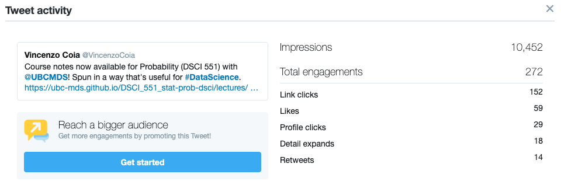

# Statement of vision for education in statistics and data science

<!-- EL = an activity taken at UBC and elsewhere to advance innovation in teaching and learning with impact beyond one’s classroom -->

<!-- I imagine this section to be about how I think statistics  -->

<!-- particularly attractive: Candidates motivated to innovate around the teaching of both core statistical topics (e.g., estimation, hypothesis testing) and more nascent data science topics (e.g., visualization, data wrangling, transparent and reproducible workflows). -->

<!-- from Mike: what "educational leadership" (EL) means to you and what EL you might pursue in the future. Vision for long-term career growth towards Prof of Teaching, even if it's tentative. -->

<!-- must provide evidence for promise of educational leadership at UBC and nationally or internationally -->

<!-- Asset: Experience with evidence-based teaching methods, curriculum development, course design, and other initiatives that advance the university’s ability to excel in its teaching and learning mandate.  -->

My vision for EL involves:

- reframing the map of statistics from the perspective of data science to provide a framework for solving real-world problems
- bringing to life underutilized tools and techniques. 
- Stewardship of data science: defining data science and maintaining a vision for our organizations (minor program; MDS; STAT 545A/547M, etc), promoting responsible use of data science.

Why does the way in which we approach statistics for data science need reframing? In short, this is because Statistical Science focusses on describing consequences of a framework of stochastic assumptions (a "framework-first" approach), and Data Science focusses on addressing real-world problems using tools described by Statistical Science (a "problem-first" approach). The ability to solve real-world problems does not directly follow from Statistical Science, because real problems don't neatly satisfy assumptions. Instead, Statistics for Data Science involves a critical evaluation of assumptions in terms of their usefulness and their goodness of approximation -- this is more than "assumption checking", it's "assumption building". Even Applied Statistics may seem to take a problem-first approach, but the motivating real-world problem tends to be used as motivation for setting up a framework of assumptions, for which properties are then described (as usual).

Reframing Statistics for Data Science involves modularizing _scenarios_ instead of _methods_. Perhaps the best example of this is DSCI 562 (Regression II), which I re-developed last year. Instead of teaching "GLM's" and "Survival Analysis", I teach "Regression when the range of the response is restricted", or "Regression when data are censored". The idea behind this is that students can then handle combined scenarios, such as "regression when the range of the response is restricted and data are censored", because they've learned model _modifications_ in each topic, not just the isolated models themselves. This scenario-first approach naturally promotes motivation in the classroom, because the topics are designed to be practical. This is also a tremendous opportunity for me and UBC, because I'm finding a general lack of this type of focus. I'm hoping to be a leader in this area. Because I take a scenario-based approach, it's important to find motivating real-world problems to lead a powerful discussion. Where possible, I draw from my industry experience and capstone. For example, using the BCMEA example for DSCI 551, flood forecasting for DSCI 562, or determining the effect of blue-light-blocking glasses on sleep for DSCI 561. I've found that these examples spur lots of great discussion.

To reframe Statistics, I've been developing a book called "Interpreting Regression" that teaches a scenario-first approach, and intent to continue its development. When I've had the opportunity, I've been writing course notes to be recycled in this book. Some of the topics which I feel have a new perspective include:

- Survival analysis resources focus on the how of the Proportional hazards or Accelerated Failure models, or the survival curve estimation. First of all, with a lack of attention placed on the value and interpretation of distributions, survival curves and hazard functions are right off the bat a confusing introduction. Then, why we would even bother estimating such a thing, or setting up such a model, are not discussed. Also, the relationship between the Kaplan-Meier survival curve and the survival regression models is not clear. It's also not clear how one would apply machine learning methods with censored data. Again -- the framework has been set up (assumptions laid out for PH model or AF model), and properties described of these models (beta's are log hazard ratio), but this leaves students thinking "I guess this is just what we do when faced with censored data", as opposed to the more creative approach of making decisions on the modular components of modelling.
- The teaching of MLE focusses on the how, and even then, it's hard to find a good resource on the how. But, after ample searching, I've yet to find the why of MLE, and this is because it's not framed in terms of deciding which assumptions to enforce in your model.
- multiple imputation for missing data as plugging in a distribution to get marginal quantities. Without this being explained, students are left thinking "I guess we should just use multiple imputation when faced with missing data, because that's just what we do".

With a reframing of Statistics brings to light areas of Statistics that are useful, yet are not receiving much attention. These underutilized tools and techniques have already been described by statisticians, but their underuse perhaps stems from their misunderstanding / emphasis as only being required as assumptions, as well as our community's obsession with the mean. In addition to writing about these, I'm also developing software. Here are examples:

- There is a wealth of value that using both parametric and non-parametric distributions for the response can bring to data science -- "distributional forecasting".
	- I am developing an R package that works with distributions as objects, as opposed to handling the unwieldly pieces of functions like `dnorm()` and `rnbinom()`. My goal is to submit this package to CRAN and ROpenSci, and perhaps grab the attention of RStudio and the `tidymodels` team. 
- By extension, another area of statistics that I believe are underappreciated are copulas. Once distributional forecasting is truly appreciated, then copulas become invaluable for parametric modelling for prediction, as well as providing new insight into the properties of data. I believe that copulas are currently not accessible enough due to complicated formulas and jargon, yet are tremendously useful for distributional forecasting. I hope to make this framework more accessible by developing an R package called `coperate` and `cmc` for easy manipulation of copulas, and easily created copula-based models (respectively).
- Extreme value modelling also becomes invaluable for those cases that have heavy tailed data, such as at least one capstone project from Seahorse strategies (the team didn't end up using EVT because of lack of attention here, but should have), as well as organizations tackling the issue of flood forecasting and flood frequency assessments.  Again, submitted to CRAN and ROpenSci. Extreme value models will be easy to build using the distplyr package I mentioned earlier by easily grafting distributional tails with `distplyr::right_connect()` and `distplyr::left_connect()`.

I also envision being a steward for data science by defining data science and hosting a data science workshop / conference. This is important to keep the dialogue open about just how we should go about teaching data science (so that insight such as what's presented here is spread), and what we should consider as being within the realm of data science. Taking the opportunity early to do this will help in our efforts of establishing ourselves as leaders in the field of data science. The beginnings of this workshop are underway, the first step of which was defining a vision for MDS, which I initiated.

I envision using the above three components for developing curricula at UBC, whether it be comtinuing to develop MDS, building a minor program, or other things. I also envision making this material public to establish ourselves as leaders in data science. Examples of courses that I've already redeveloped:

- Curriculum development of 551 throughout the years; 561 w/ Gaby and Sunny, later Tom; 531; 511?; 563; BAIT 509; 562; STAT 545A/547M (expanded Jenny's work, but this needs more help, especially in the face of a changing data science landscape at UBC).

Lastly, an area that is crucial for EL, yet might not be called EL itself, is continuing to work with external partners, such as the Master of Data Science (MDS) capstone partners, to understand their pressing data issues, and lend a hand once in a while. As Stephen Covey says in "The 7 Habits of Highly Effective People", to be effective, one must "sharpen the saw" to keep yourself healthy -- except here, this is about remaining current and relevant. This is important for keeping myself and data science education at UBC relevant, as well as continually expanding my skillset. Besides having mentored MDS capstone projects for the past three years, I also did some work on flood forecasting with BGC Engineering this past summer, and plan to continue doing more. There are also simpler ways to sharpen the saw, including staying in touch with the data science community through Twitter, students and colleagues at UBC, newsletters such as ROpenSci and RStudio, as well as just plain looking for solutions to a new problem, or new solutions to an old problem. 

To summarize my envisioned educational leadership throughout my career, as I see it now:

- Developing R packages with colleagues to help reframe statistics for data science through modular assumptions:
	- distplyr for distributional forecasting: distributions as S3 objects in R, which can be manipulated and easily visualized.
	- coperate for easily understanding and handling copulas.
	- cmc
- Writing public resources. I envision these as being "go-to" resources for learning, and making decisions based on the modularity of assumptions.
	- Books for reframing statistics, starting with "Interpreting Regression", then perhaps moving on to distributional forecasting.
	- Vignettes and journal articles about the use of said R packages.
	- Course materials made public.
	- Data science "cheat sheets", especially when it comes to a guide for making decision about model assumptions.
- Hosting an annual "Education in Data Science" workshop/conference (we are already in the early stages of this).
	- Also, keeping an MDS vision statement. 

"Sharpening the saw" by work with other organizations, and keeping up with the community.
